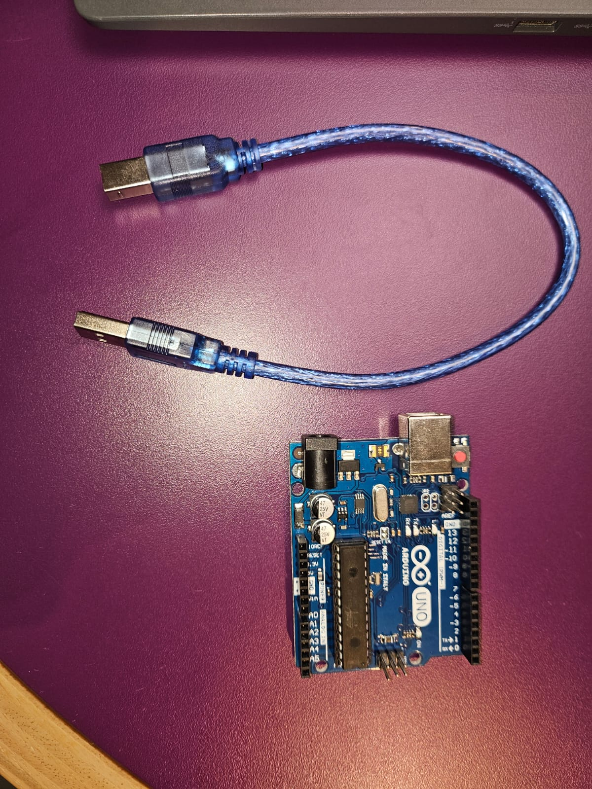

# ATIVIDADE PONDERADA DE PROGRAMAÇÃO

## Estudante: Giovanna Fátima de Britto Vieira

### Instruções

#### Parte 1: Blink Led Interno  

Instale a Arduino IDE em seu computador e assista aos vídeos indicados nos autoestudos conforme o roteiro descrito anteriormente. Você deverá realizar o "blink" com esse LED Interno e postar em seu GitHub as evidências dessa realização. 

Você vai fazer o led ficar aceso por um tempo X, apagar e aguardar Y segundos e depois voltar a acender, propondo um loop que gera uma "luz piscando".

⚠️ **Entrega Parte 1**: em seu GitHub pessoal (usando sua conta com email Inteli), inserir screenshots de sua tela com o IDE e seu código, além de uma fotografia que demonstre seu Arduino ligado no computador e o seu led aceso. Você também poderá enviar um vídeo que evidencie esse funcionamento.


#### Parte 2: Simulando Blink Externo
Nessa `parte 2` você deverá fazer uma simulação **no TinkerCad** com uma montagem do pisca-pisca com Arduino Uno. Ao clicar no play do TinkerCad, o projeto deve executar sem erros uma rotina que simula um pisca-pisca de qualquer cadência. Utilize no projeto um protoboard, ligações elétricas, LED (precisa ser um OFF_BOARD), resistor e um Arduino. 

Envie o link do seu projeto do Tinkercad na Adalove. Obtenha o código do Tinkercad, publique no seu repositório pessoal do GitHub e também envie este link no card.

---

### Desenvolvimento da Atividade

#### Introdução

Esta atividade ponderada de programação tem como objetivo introduzir e praticar o uso da plataforma Arduino para controle de dispositivos eletrônicos e simulações utilizando o TinkerCad. O foco principal é desenvolver um projeto simples, onde o estudante realiza a programação para acionar um LED, tanto internamente no Arduino quanto externamente em um protótipo simulado. A atividade é dividida em duas partes:

1. **Parte 1:** Utilização do LED interno do Arduino para criar um efeito de pisca-pisca, desenvolvendo o código na Arduino IDE e realizando a execução diretamente no hardware.
   
2. **Parte 2:** Simulação de um circuito eletrônico no TinkerCad, utilizando um LED externo, protoboard e resistor, simulando o mesmo efeito de pisca-pisca, porém em um ambiente virtual.

3. **Parte 3:** Após a conclusão da simulação no TinkerCad, foi realizado um teste prático utilizando os mesmos componentes em um ambiente físico. O circuito foi montado com o Arduino Uno, um LED externo, resistor, protoboard e os fios de conexão, seguindo exatamente o mesmo esquema da simulação.

Por meio desta atividade, eu tive a oportunidade de entender o funcionamento básico do Arduino e conceitos de eletrônica, praticar a escrita de código em C++ e ainda desenvolver projetos de eletrônica com os componentes físicos, conforme descrito abaixo.

#### **Desenvolvimento da Parte 1**
Para o desenvolvimento da primeira parte da atividade foi seguido a seguinte sequência de passos:

**Passo 1: Separação dos Materiais**

A primeira parte da execução da atividade consistiu na separação dos materiais.

<div align="center">
  <p> <b>Figura 1 </b> - Separação dos Materiais</p>

 <p><b>Fonte:</b> Material elaborado pelo autor (2024)</p>
</div>

Sendo assim, conforme evidenciado na imagem, os materiais utilizados para essa atividade foram:
- **Arduino Uno**
- **Cabo USB para conectar o Arduino**

**Passo 2: Conexão do Cabo USB no computador**

O segundo passo de execução consiste na conexão do Cabo USB no computador, conforme consta na imagem a seguir.

<div align="center">
  <p> <b>Figura 2 </b> - Conexão do Cabo USB no computador</p>

 <p><b>Fonte:</b> Material elaborado pelo autor (2024)</p>
</div>

**Passo 3: Conexão do Cabo USB no Arduino**

O terceiro passo de execução consiste na conexão do Cabo USB no Arduino, evidenciado na imagem abaixo.

<div align="center">
  <p> <b>Figura 3 </b> - Conexão do Cabo USB no Arduino</p>

 <p><b>Fonte:</b> Material elaborado pelo autor (2024)</p>
</div>

**Passo 4: Criação do Código**

O quarto passo da atividade consistiu na criação do código para acender o LED interno do Arduino (imagem abaixo).

<div align="center">
  <p> <b>Figura 4 </b> - Codigo do Blink</p>

 <p><b>Fonte:</b> Material elaborado pelo autor (2024)</p>
</div>


**Explicação do Código:**

1. **Função setup()**:
   - A função pinMode() foi usada para configurar o pino **LED_BUILTIN** (o LED interno do Arduino no pino 13) como uma saída. Isso significa que o Arduino será capaz de enviar sinais de controle para ligar ou desligar o LED.

2. **Função loop()**:
   - A função loop() é executada repetidamente após o setup(), e é nela que está o código que controla o LED.
   - Primeiro, foi usada a função digitalWrite() para definir o valor **HIGH** (alto) no pino do LED, o que faz com que o LED acenda.

   ```cpp
   digitalWrite(LED_BUILTIN, HIGH);
   ```

   - Em seguida, foi utilizada a função delay(1000) para aguardar 1000 milissegundos (ou 1 segundo), mantendo o LED aceso por 1 segundo.

   ```cpp
   delay(1000);
   ```

   - Depois, o comando digitalWrite(LED_BUILTIN, LOW) apaga o LED, definindo o valor **LOW** (baixo) no pino correspondente.

   ```cpp
   digitalWrite(LED_BUILTIN, LOW);
   ```

   - Por fim, outro delay(1000) é usado para esperar mais 1 segundo com o LED apagado, antes de repetir o ciclo.

   ```cpp
   delay(1000);
   ```


Dessa forma, O Arduino continuará executando o código dentro de loop() indefinidamente, o que faz com que o LED continue piscando: acendendo por 1 segundo, apagando por 1 segundo, e assim por diante.


**Passo 5: Verificação e Compilação**

O quinto passo da atividade consistiu na verificação e compilação do código na placa do arduino, sendo assim primeiro foi selecionado o botão de verificação na IDE do Arduino (figura 5), para então ser selecionado o botão de compilação (figura 6).

<div align="center">
  <p> <b>Figura 5 </b> - Verificação do Código Desenvolvido</p>

 <p><b>Fonte:</b> Material elaborado pelo autor (2024)</p>
</div>

<div align="center">
  <p> <b>Figura 6 </b> - Compilação do Código Desenvolvido no Arduino</p>

 <p><b>Fonte:</b> Material elaborado pelo autor (2024)</p>
</div>

#### Resultado da Parte 1
Após seguir todas as etapas descritas acima é possível visualizar o LED interno do Arduino ficando aceso por 1 segundo e ficando desligado por 1 segundo, conforme evidenciado no vídeo a seguir.

<video width="320" height="240" controls>
  <source src="assets/blinkfuncionando.mp4" type="video/mp4">
</video>

---
#### Desenvolvimento da Parte 2

Agora para o desenvolvimento da parte dois foi seguida as seguintes etapas de execução.

**Passo 1: Acesso do TinkerCad:**

Eu fiz o login na sua minha conta do TinkerCad e criei um novo projeto.

**Passo 2:  Montagem no Protoboard:**

O segundo passo consistiu na montagem do circuito no TinkerCad com os seguintes componentes:
     - Protoboard
     - LED externo
     - Resistor
     - Fios de conexão
     - Arduino Uno

Após isso, o LED foi colocado no protoboard com o resistor, enquanto os cabos foram conectados, conforme consta na imagem a seguir.

<div align="center">
  <p> <b>Figura 7 </b> - Simulação  do Circuito no TinkerCad</p>

 <p><b>Fonte:</b> Material elaborado pelo autor (2024)</p>
</div>

O circuito acima simula o funcionamento de um LED externo controlado pelo Arduino Uno, utilizando um protoboard e alguns componentes básicos, como LED, resistor e os Cabos de conexão (intitulados "macho-macho"). O objetivo dessa simulação é fazer o LED piscar com base em um código carregado no Arduino. Para isso, foram feitas duas conexões principais:

1. **Conexão do LED e Resistor**:
   - O LED está montado na protoboard, com o terminal positivo (ânodo) conectado ao pino 11 do Arduino através de um fio vermelho. O terminal negativo (cátodo) do LED está conectado ao resistor.
   - O resistor está ligado entre o cátodo do LED e a linha de GND (terra) no protoboard, que por sua vez está conectada ao pino GND do Arduino.

2. **Conexão do Arduino ao Protoboard**:
   - O pino 11 do Arduino é utilizado como saída digital, que controlará quando o LED será ligado ou desligado. O fio vermelho que sai do pino 11 está conectado à linha positiva (ânodo) do LED no protoboard.
   - O pino GND (terra) do Arduino está conectado à linha de GND do protoboard por meio de um fio preto, fornecendo a referência de terra para o circuito.

Por meio dessas conexões, quando o código do Arduino ativa o pino 11, ele envia um sinal de HIGH para o LED, permitindo que a corrente flua do pino 11, passando pelo LED, através do resistor e indo para o GND. Isso faz com que o LED acenda. Já Quando o pino 11 é desativado (sinal LOW), a corrente para de fluir, e o LED se apaga.

O Vídeo a seguir evidencia o funcionamento do circuito e o código desenvolvido para obter esse resultado.

<div align="center">
<video width="320" height="240" controls>
  <source src="assets/videoSimulacao.mp4" type="video/mp4">
</video>
</div>


O uso do resistor nesse circuito garante que a corrente seja limitada, protegendo o LED de danos por excesso de corrente.

Para acessar o projeto desenvolvido basta acessar o seguinte [link](https://www.tinkercad.com/things/kLQplJal3rH/editel?sharecode=WMbBZjQkJszlHd8IdG0rwK1Z_j7MQ_HSpzrk4cISEDo) ou então o [arquivo](assets/simulacao.brd) desse projeto.

---

#### **Desenvolvimento Físico** 

Após a realização da simulação descrita acima, foi feito a montagem do circuito com os materiais físicos, sendo assim, os seguintes passos foram seguidos para o atendimento da simulação.

**Passo 1: Separação dos Materiais**

O primeiro passo consistiu na separação dos materiais que seriam utilizados para essa montagem, sendo esses:

<div align="center">
  <p> <b>Figura 8 </b> - Separação dos Materiais</p>

 <p><b>Fonte:</b> Material elaborado pelo autor (2024)</p>
</div>

Os materiais presentes na imagem consistem em:
- Arduino Uno
- Cabo USB
- Protoboard
- LED Verde
- Resistor (1 kΩ)
- Fios de conexão (macho-macho)

**Passo 2: LED e Resistor foram colocados na Protoboard**

No segundo passo, o LED foi colocado na Protoboard, assim como o resistor. Porém, o resistor foi colocado no polo positivo do Led (Anôdo).

<div align="center">
  <p> <b>Figura 9 </b> -Led e Resistor na Protoboar</p>

 <p><b>Fonte:</b> Material elaborado pelo autor (2024)</p>
</div>

**Passo 3: Conexão do LED no Arduino**

O terceiro passo consistiu na conexão do LED no Arduino, sendo assim o polo negativo do LED foi conectado por um jumper Macho-macho laranja no pino GND (terra) - Figura 11, enquanto o resistor - conectado ao polo positivo, foi colocado no pino 11 (figura 12).

<div align="center">
  <p> <b>Figura 11 </b> - Conexão do Polo Negativo no Arduino </p>

 <p><b>Fonte:</b> Material elaborado pelo autor (2024)</p>
</div>

<div align="center">
  <p> <b>Figura 12 </b> - Conexão do Polo Positivo no Arduino </p>

 <p><b>Fonte:</b> Material elaborado pelo autor (2024)</p>
</div>

**Passo 4: Desenvolvimento do Código**

Após a montagem do circuito, foi utilizado o código desenvolvido no simulador TinkerCad na IDE do Arduino, conforme consta na imagem abaixo.

<div align="center">
  <p> <b>Figura 13 </b> - Código para Acender o LED</p>

 <p><b>Fonte:</b> Material elaborado pelo autor (2024)</p>
</div>


**Explicação do Código:**

1. **Função setup()**:
   - O comando pinMode(11, OUTPUT) define o pino digital 11 do Arduino como uma saída, o que significa que ele será utilizado para controlar o LED conectado a este pino.

   ```cpp
   pinMode(11, OUTPUT);
   ```

2. **Função loop()**:
   - A função loop() é executada continuamente após o setup(). O código aqui é responsável por controlar o estado do LED (ligado e desligado) de forma repetitiva.

   - Primeiro, a função digitalWrite(11, HIGH) envia um sinal HIGH (alto) para o pino 11, o que faz com que o LED acenda.

   ```cpp
   digitalWrite(11, HIGH);
   ```

   - Após o LED ser aceso, a função delay(1000) é utilizada para esperar 1000 milissegundos (1 segundo) antes de continuar a execução do código.

   ```cpp
   delay(1000);
   ```

   - Em seguida, o comando digitalWrite(11, LOW) envia um sinal LOW para o pino 11, desligando o LED.

   ```cpp
   digitalWrite(11, LOW);
   ```

   - O segundo delay(1000) é utilizado para esperar mais 1 segundo com o LED apagado antes de o ciclo se repetir.

   ```cpp
   delay(1000);
   ```

Dessa forma, este código faz o LED externo, conectado ao pino digital 11 do Arduino, piscar em intervalos de 1 segundo. O LED permanece ligado por 1 segundo e, em seguida, é desligado por mais 1 segundo, criando um padrão contínuo de pisca-pisca. 

**Passo 5: Verificação e Compilação**

O quinto passo da atividade consistiu na verificação e compilação do código na placa do arduino, sendo assim primeiro foi selecionado o botão de verificação na IDE do Arduino (figura 14), para então ser selecionado o botão de compilação (figura 15).

<div align="center">
  <p> <b>Figura 14 </b> - Verificação do Código Desenvolvido</p>

 <p><b>Fonte:</b> Material elaborado pelo autor (2024)</p>
</div>

<div align="center">
  <p> <b>Figura 15 </b> - Compilação do Código Desenvolvido no Arduino</p>

 <p><b>Fonte:</b> Material elaborado pelo autor (2024)</p>
</div>

#### Resultado do Desenvolvimento Físico

Após a execução de todas essas etapas, foi possível obter o seguinte resultado com o circuito:

<div align="center">
<video width="320" height="240" controls>
  <source src="assets/ledFuncionando.mp4" type="video/mp4">
</video>
</div>

### Conclusão

Através da execução desta atividade, foi possível aprender e aplicar conceitos do uso da plataforma Arduino, tanto no ambiente físico quanto em simulações virtuais. A primeira parte da atividade focou no controle do LED interno do Arduino, permitindo a compreensão dos primeiros passos na criação de um loop básico para fazer um LED piscar.

Na segunda parte, a simulação do circuito no TinkerCad demonstrou a importância de ferramentas de prototipagem virtual para testar e validar um projeto antes de sua implementação física. A montagem do circuito e a utilização de componentes como o LED externo, resistor e protoboard, mostrou como é possível criar um projeto de controle de dispositivos eletrônicos sem a necessidade de um hardware físico, facilitando a validação do código e do circuito.

Por fim, a implementação do circuito físico replicando a simulação realizada no TinkerCad permitiu a verificação de que o comportamento previsto funcionou corretamente no mundo real. O LED externo piscou conforme programado, demonstrando a eficácia do código e da montagem do circuito. Além disso, o uso de um resistor mostrou-se essencial para proteger o LED, validando o entendimento dos conceitos básicos de eletrônica.

Por fim, essa atividade proporcionou muito aprendizado, desde a simulação até a montagem prática, reforçando a importância de cada etapa no desenvolvimento de soluções baseadas em Arduino. Como resultado, foi possível não apenas executar a tarefa solicitada, mas também consolidar conhecimentos que serão importante para a execução do projeto.

### Materiais Extras

Para acessar os códigos desenvolvidos basta seguir os seguintes links:
- [Código do LED Interno](codigos/codigoBlink.ino)
- [Código do LED Externo](codigos/codigoLed.ino)
